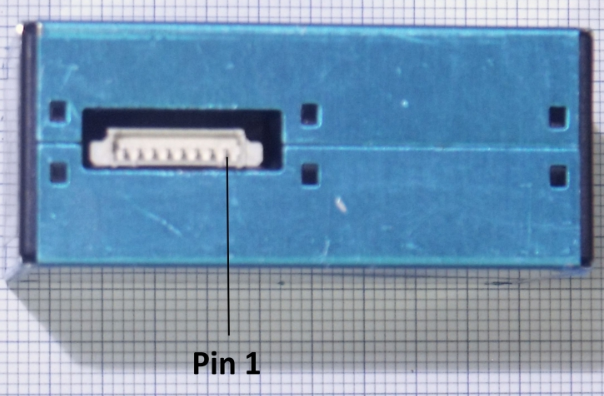

# pms5003

O PMS 5003 é um um sensor de concentração de partículas digital e universal, extremamente preciso, capaz de captar partículas de até 0.3μm.

# Princípio de Funcionamento

Através do espalhamento de laser dentro do cabine, há uma irradiação nas partículas presentes no interior do sensor (causando assim uma mudança nos feixes do laser em relação a condição inicial). Em seguida, tendo a alteração nos feixes do laser, os dados são coletados.

# Objetivos

 - Entender e verificar as ligações do sensor 
 - Desenvolver o código 

# DataSheet

Primeiramente é preciso verificar o DataSheet, assim encontrando informações mais completas do sensor em relação a informações técnicas, etc.

- pms5003-manual_v2-3

# Preparação 

### Materiais

- Arduino
- Sensor pms5003
- Conversor de nível lógico
- 2 resistores 10K

### IDE

- Arduino IDE

### Bibliotecas

- AltSoftSerial-master
- pms5003-master

# Conexões

**Importante:** o sensor PMS5003 usa 5V para o funcionamento do ventilador que ele contém e 3,3V para lógica e obtenção de dados.

O sensor contém 8 pins, a contagem dos pins começa da direita para a esquerda, como é perceptível na imagem:

Pinos   | Função | Definição
--------|--------|----------
PIN 1    | VCC    | Tensão de 5V
PIN 2    | GND    | Terra
PIN 3    | SET    | Define a tensão em 3.3V, alto nível ou suspendendo é um status normal de trabalho, enquanto baixo nível é o modo de descanso
PIN 4   | RX     | Porta serial recebendo dados / 3.3V
PIN 5   | TX     | Porta serial enviando dados / 3.3V
PIN 6   | RESET  | Reseta o sinal
PIN 7/8 | NC     |

